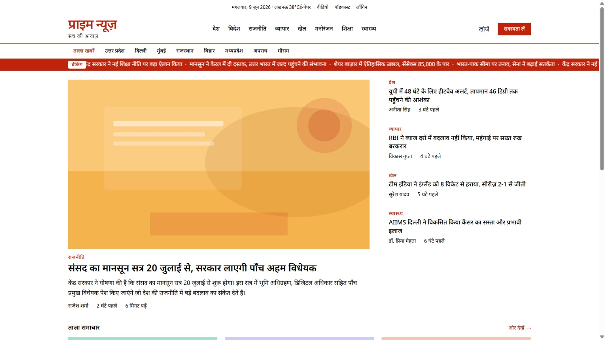
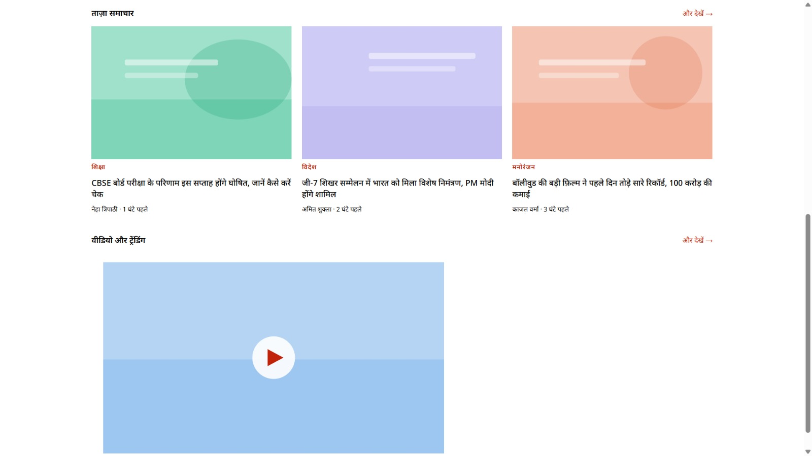

# 📰 Prime News - Hindi News Website

A modern and responsive Hindi News Website built using **HTML, CSS, and JavaScript**. The project features a clean newspaper-style layout, breaking news ticker, category filtering, article search, trending news section, subscription modal, and interactive user experience.

---

## 📌 Project Overview

**Prime News** is a front-end news portal designed to present news content in a professional and user-friendly format. The website is fully responsive and provides a newspaper-inspired interface for browsing news across multiple categories.

This project demonstrates the use of:

- Semantic HTML5
- Modern CSS3 Layouts (Grid & Flexbox)
- Vanilla JavaScript DOM Manipulation
- Responsive Design Principles
- Interactive UI Components

---

## 📸 Screenshots

### Homepage


### News Section



---

## ✨ Features

### 📰 News Homepage
- Hero news section
- Featured headline article
- Side news panel
- Latest news cards

### 🔍 Search Functionality
- Full-screen search overlay
- Live article filtering
- Instant search results

### 📂 Category Filtering
- Politics
- National
- International
- Business
- Sports
- Entertainment
- Education
- Health

### 📈 Trending Section
- Trending news ranking
- Popular articles display

### 🎥 Video Section
- Featured video content card
- Video news preview layout

### 📬 Subscription System
- Newsletter subscription modal
- Email validation
- User feedback alerts

### 📱 Responsive Design
- Desktop layout
- Tablet support
- Mobile-friendly interface

### 🎨 Modern UI
- Hindi typography support
- Clean newspaper styling
- Smooth animations
- Modal system
- Breaking news ticker

---

## 📁 Project Structure

```text
news-website-package/
│
├── index.html
├── style.css
├── script.js
├── README.md
│
└── assets/
    └── images/
        ├── view1.jpeg
        ├── view2.jpeg
        └── ...
```
---

## 🛠 Technologies Used

| Technology | Purpose |
|------------|----------|
| HTML5 | Website Structure |
| CSS3 | Styling & Layout |
| JavaScript (ES6) | Interactivity |
| Google Fonts | Hindi Typography |
| SVG Graphics | Placeholder Images |

---

## 🎯 Future Improvements

Planned enhancements include:

- Backend Integration
- News API Support
- User Authentication
- Admin Dashboard
- Content Management System (CMS)
- Dark Mode
- Article Comments
- Social Media Sharing
- Push Notifications
- Multi-language Support
- Real-Time News Updates

---

## 📈 Performance

- Lightweight Design
- Fast Loading Speed
- Optimized CSS
- Pure JavaScript (No Framework)
- Responsive Layout

---

### 🚀 Prime News — Delivering Fast, Reliable, and Modern Digital News Experience
